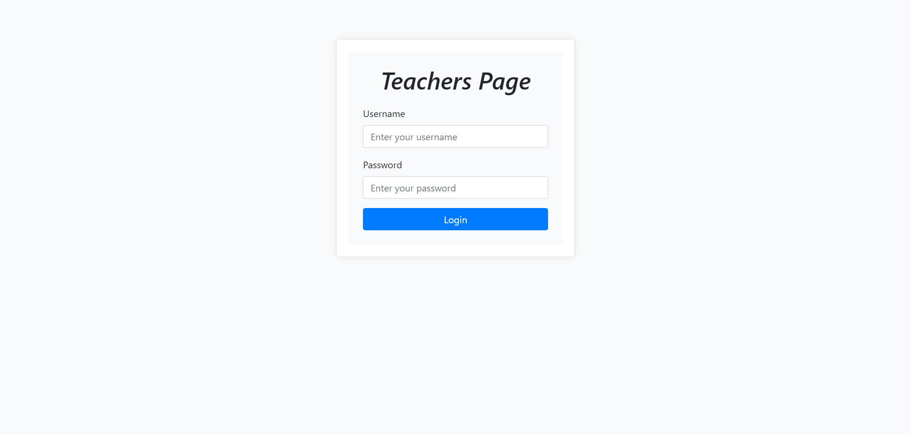
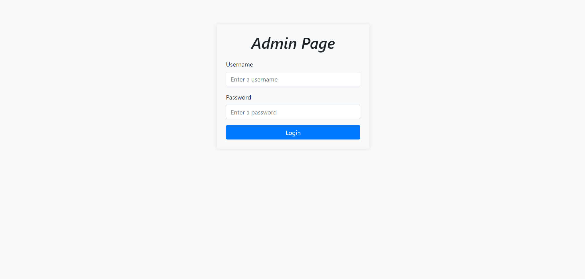
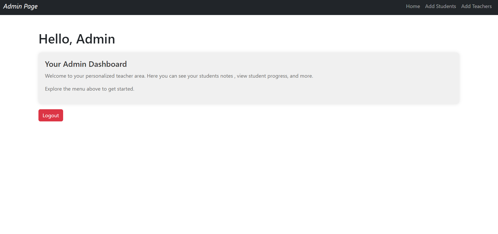
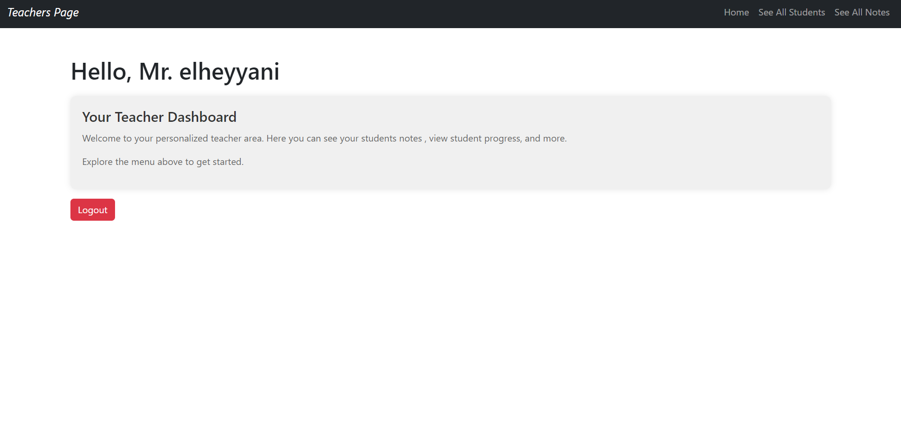

📚 Student Management System
The JIRA (Project / Modelisation diagrams / Sprints) FOR MEMBERS 🔒: [Jira Board Link](https://ataouil90.atlassian.net/jira/software/projects/SCRUM/boards/1?atlOrigin=eyJpIjoiYWFhMzM1NWExYzZiNDBiMThhZTk4NTYyYjkwNzg4YjYiLCJwIjoiaiJ9)

A full-stack web application designed to manage student and instructor data, courses, and grades. The system allows administrators, instructors, and students to manage and track progress, assignments, and notes.

🌟 Features

Administrator Features:
Add Students: Administrators can register students into the system.
Add Instructors: Administrators can add instructors to the platform.
Add Classes: Administrators can create new classes.
Add Modules: Administrators can assign modules to classes.
Manage Class Assignments: Administrators can assign students to the correct classes.
Instructor Features:
Add and Manage Grades: Instructors can input grades for students.
Modify Grades: Instructors can modify existing grades.
Delete Grades: Instructors can delete grades if needed.
View All Module Grades: Instructors can see grades for all modules they teach.
View Individual Student Grades: Instructors can see grades for individual students in their classes.
Student Features:
View Grades: Students can view their own grades for all modules and assignments.
Director Features:
Validate Student Grades: The director can approve final student grades, ensuring that they are accurate and final.
🛠️ Technologies Used
Frontend: HTML5, CSS3, JavaScript
Backend: PHP
Database: MySQL
Additional: PDO (PHP Data Objects) for database operations

📋 Prerequisites
PHP >= 8.1
MySQL >= 5.7
Web server (XAMPP/Nginx)
Web browser

⚙️ Installation

Clone the repository
bash
Copier le code
git clone https://github.com/YourUsername/StudentManagementSystem
Import the database
Create a new database named student_management_db.
Import the student_management_db.sql file from the project root.
Configure the database connection
Open components/connect.php and update the database credentials if needed.
Start your web server

Access the application

Student Panel: http://localhost/StudentManagementSystem
Admin Panel: http://localhost/StudentManagementSystem/admin
👤 Default Admin Credentials

Username: admin
Password: admin123
📱 Screenshots
🔓 Login Pages:

🏠 Home Pages:

🔒 Security Features

Password hashing using SHA1
Input sanitization
Session management
SQL injection prevention using PDO prepared statements
Access control for admin panel
🗂️ Project Structure

bash
Copier le code
student-management-system/
├── admin/                   # Admin panel files
├── components/              # Reusable PHP components
├── css/                     # Stylesheets
├── js/                      # JavaScript files
├── uploaded_img/            # Product images (e.g., student photos, course images)
├── *.php                    # Main PHP files
└── student_management_db.sql # Database file
💡 Key Features Explained

User Management
Secure registration and login system
Profile management with update capabilities
Address management for student profiles
Class and Module Management
Administrators can add new classes and modules
Modules are associated with classes
Students can be enrolled in classes
Grade Management
Instructors can add, modify, and delete student grades
Students can track their own grades for each module
Admin Dashboard
Admins can track and manage students, instructors, and grades
Admins can validate and approve final grades
🤝 Contributing
Contributions are welcome! Please feel free to submit a Pull Request.

📄 License
This project is licensed under the MIT License - see the LICENSE file for details.

👨‍💻 Author
Your Name | Omar Bouazzaoui / Taouil Aboubakr / Walid lkheraq / Abdessamad Louali

🙏 Acknowledgments
Font Awesome for icons

This README now includes the relevant user stories and features of the Student Management System you described, along with installation steps and other details.
